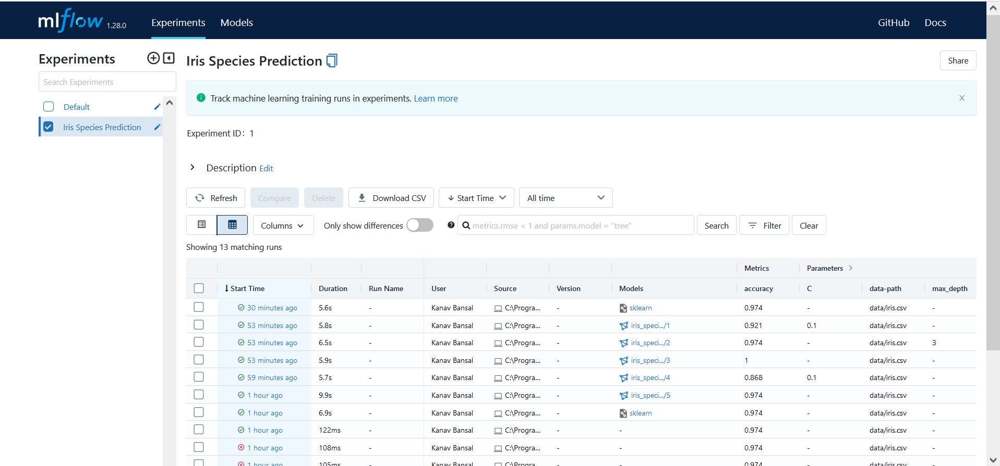

# We will learn Experiment Tracking and Model Management

## Introduction to Experiment Tracking
**Terminologies:**
> 1. Experiment  
> 2. Run  
> 3. Metadata  (i.e. Tags, Parameters, Metrics)  
> 4. Artifacts (i.e. Output files associated with experiment runs)

**What do you want to track for each Experiment Run?**
1. Training and Validation Data Used
2. Hyperparameters
3. Metrics
4. Models

**Why Track?**
> Organization
> Optimization
> Reproducibility

**Tool - MLFlow**  
MLFlow helps you to organize your experiments into runs.

**MLFlow keeps track of:**
> Tags  
> Parameters  
> Metrics  
> Models  
> Artifact  
> Source code, Start and End Time, Authors etc..

**Run below mentioned commands to install mlflow on your system:**
```
pip install mlflow
mlflow ui --backend-store-uri sqlite:///mlflow.db
```
*** 

## Introduction to MLFlow

**Step 1 - Import MLFlow**
> `import mlflow`

**Step 2 - Set the tracker and experiment**
> `mlflow.set_tracking_uri(DATABASE_URI)`  
> `mlflow.set_experiment("EXPERIMENT_NAME")`

**Step 3 - Start a experiment run**
> `with mlflow.start_run():`

**Step 4 - Logging the metadata**
> `mlflow.set_tag(KEY, VALUE)`  
> `mlflow.log_param(KEY, VALUE)`
> `mlflow.log_metric(KEY, VALUE)`

**Step 5 - Logging the model and other files (2 ways)**
> **Way 1 -** `mlflow.<FRAMEWORK>.log_model(MODEL_OBJECT, artifact_path="PATH")`  
> **Way 2 -** `mlflow.log_artifact(LOCAL_PATH, artifact_path="PATH")`


## MLFlow Interface for Tracking Experiments


***

## MLFlow Interface for Model Management


