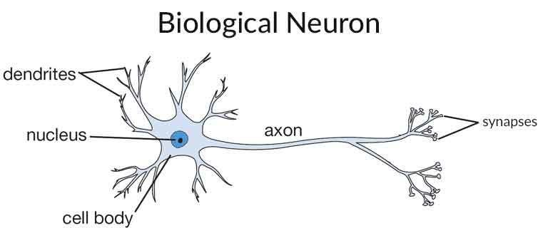

# Introduction to Deep Learning

Human Intelligence has always been fascinating for scientist. Understanding how brain works can answer a lot of important questions. Because of a lot of research in the area of neuro science, there is a vague understanding on how the brain works. We know that there is something called as **BIOLOGICAL NEURON** which acts as abasic building block. 

---

## History

---
- 1957 - Perceptron based model by Rosenblatt
- 1960's to 1980's - Attempts at creating the network of artificial neurons
- 1986 - Back Propogation using chain rule of differentiation by Geoffery Hinton
- 1990's - Winter for DL - Not enough compute power 
- 1995 - 2006 - SVM, GBD, RF models became powerful
- 2006 - How to train Deep Neural Network by Geoffery Hinton
- 2012 - Come back of DL in ImageNet Competition (Detect objects in images). A team used deep neural network and won the competition by very huge margin.
- 2014 - Dropouts by Nitish Srivastava (To prevent Overfitting problem)

---

## Notation
- Input Layer
- Hidden Layer
- Output Layer

## How biological neuron works?
- Neuron activates or fires when there is enough input
- Activation function

$$ O = f(\sum_{i=1}^{d} w_i*x_i) $$

---

## Specifications of Neural Network

1. Topology (i.e. Structure) - Nodes(i.e. Neurons) and Edges(i.e. Interconnections)
2. Input Layer (Depends on the number of features), Hidden Layers and Output Layer (For regression - One neuron and for classification - Number of neurons is equal to number of classes)
3. Weights and Bias
4. Activation Functions

---

## Activation function
- Sigmoid - Vanishing Gradient Problem (Convergence is slow)
- Tanh - Vanishing Gradient Problem (Convergence is slow)
- ReLU (Rectified Linear Unit)

---

## Assumptions of Neural Network

1. Neurons are arranged in layers.
2. Multiple layers of neurons exists and these layers are arranged sequentially.
3. Neurons which belong to same layer won't interact.
4. Neurons are densely connected with the adjacent layer neurons.
5. Every edge will have a weight associated with it.
6. All neurons will have the same activation function.

**NOTE - All the neurons are arranged in layers and the layers are arranged in the sequence with the first layer being the input layer and last layer being the output layer and everything in between are the hidden layers. There are interconnections between the pairs of consecutive layers.**

## Notations

---

**Add an image to demonstrate.**

---

**Activation Function**  
$$ f_{ij} \rightarrow O_{ij} \\
i: Layer Number \\
j: Neuron Number $$  

**Weights**  
$$ W_{ij}^{k} \\
i: From \ j: To \\
k: To Layer Number $$  

**Weight Matrix:**  
$ W^1 $  

\begin{pmatrix}
w_{11} & w_{12} & w_{13}\\
w_{21} & w_{22} & w_{23}\\
w_{31} & w_{32} & w_{33}\\
w_{41} & w_{42} & w_{43}\\
\end{pmatrix}

## Training a Neural Network

1. Randomly initialize $ W_{ij}^{k} $.
2. **Forward Propogation** - Feed forward ith datapoint.
3. Computer loss for ith data point.  
$$ L(y_i', y_i) $$  
4. **Backward Propogation** - Compute the derivatives using chain rule of derivation and memoization. 
5. Update the weights from end of the network to start.  
$$ (W_{ij}^{k})_{new} = (W_{ij}^{k})_{old} - r*\frac{\partial L}{\partial W} $$  
6. Repeat step 2 to 5 until convergence.

---

**Epoch** - One epoch of training means you have inputed all the training datapointsonce through the neural network. In real time, we run training for multiple epochs.

**Mini-Batch** - Instead of 1 point at a time, pass a minibatch of size 32, 64, 128, 256, etc through the network.
